# TicAuc
Tic拍卖平台（Tic是我瞎编的名字

## 使用方法

在src中使用truffle部署，文件同样在src中
然后把地址复制到src/eth/AuctionContract.js中
在根目录运行yarn start即可

## 使用流程

1. 新建Tic

   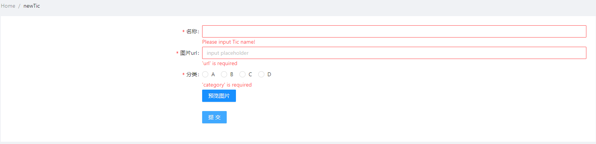

   三个项都是必填项目，不填写无法新建。由于没有服务器支持，所以图片只能使用现有的url进行上传，正确填写url（这里有url的正确性检测）之后可以点击预览图片进行预览，还可以点击查看大图

   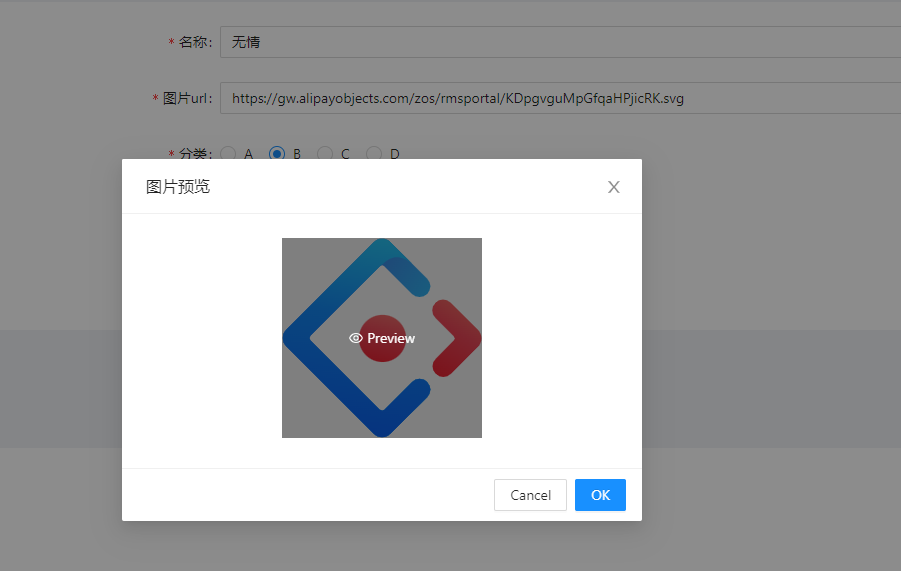

   填写完成后点击提交即可上传，从metamask确认然后上传成功后刷新回到主界面查看所有Tic

   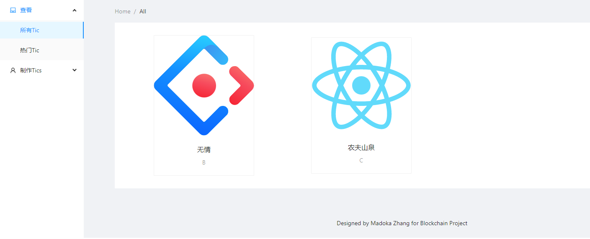

2. 查看Tic信息

   1. 所有界面下点击查看

      这里只能查看一些可公布的信息，比如新旧状况和拍卖的状况

      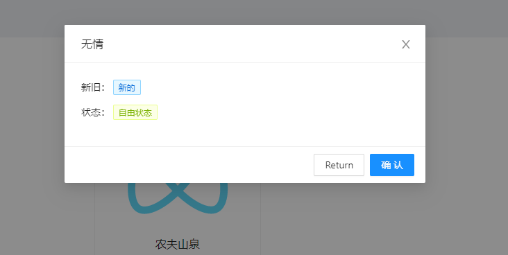

      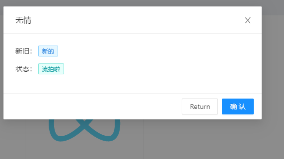

   2. 我的界面下查看

      这里可以看到历史流转信息（包括现在持有的自己）

      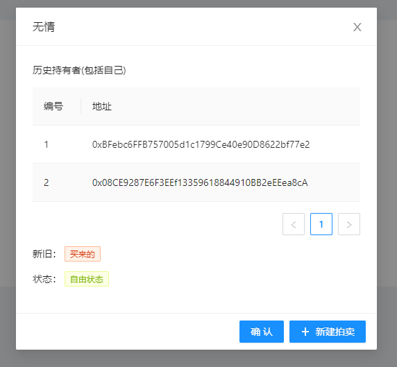

   3. 拍卖大厅中查看

      这里点击每条拍卖中Tic下的每一项来查看（标蓝），只能看到历史流转的信息，具体的Tic信息应当去主页中查看。

      
      
      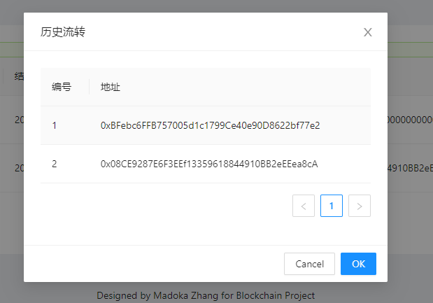

3. 拍卖流程
   
   1. 在我的界面的Tic详情页面可以选择新建拍卖，点击后弹出窗口，会直接预设起拍价为5eth和时间是当前开始三分钟后结束。
   
      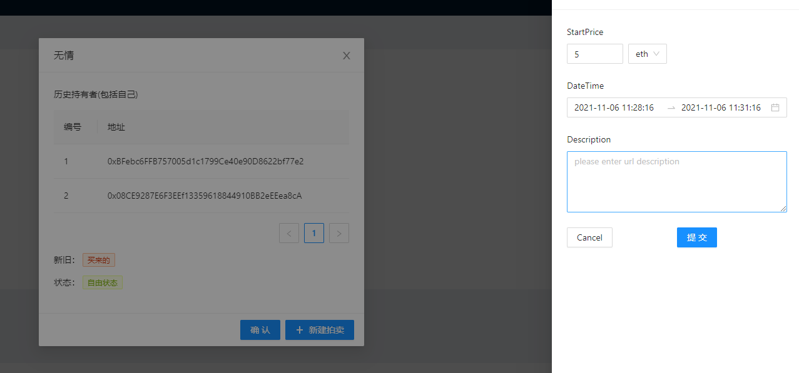
   
   2. 出价&认领&回收钱
   
      在拍卖大厅中，可以选择对应的条目进行出价
   
      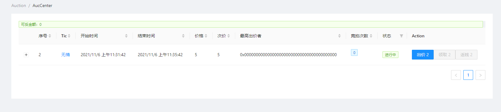
   
      点击出价按钮进行出价
      
      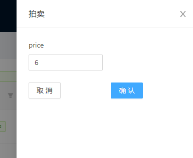
      
      符合条件的出价会被提交然后记录。这里出价是直接转钱过去了，如果当前自己的出价被覆盖了，那么就可以通过返钱的按钮来把之前的钱拿回来。拍卖结束后，可以进行认领。**注意：认领之前发起人是不能收到钱的**
      
   3. 收钱&流拍
      
      当最高出价者认领之后，就可以收钱了。如果拍卖结束后还没有人出价，需要点击流拍来记录流拍情况。
      
      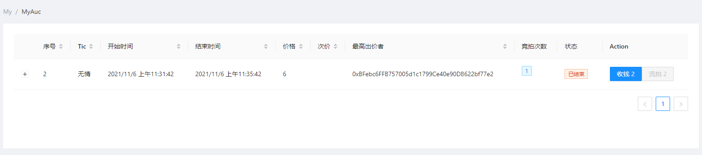
      
      
      
      
      
      
      
      

